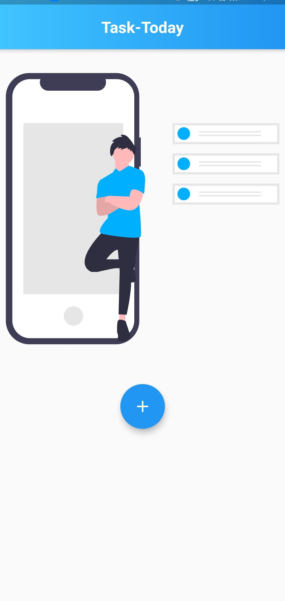
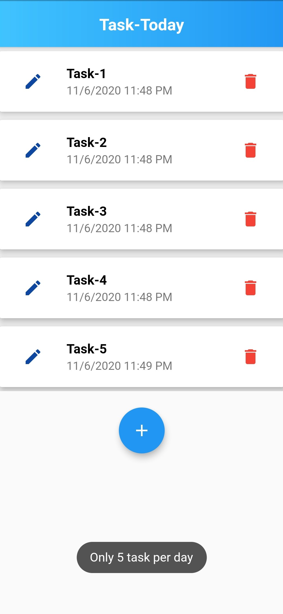

# Task-Today ✍🏼

<!--  -->

A Simple To-Do app built with Flutter

## Screenshots

<p float="left">


</p>

# Command To Install

### Install dependencies

```sh
flutter pub get
```

### Run application

```sh
flutter emulators --launch <emulator_name>
flutter run
```

### Generate MOOR

```sh
flutter packages pub run build_runner build
```

### Build

```sh
flutter build apk
```

### Run tests

```sh
flutter test
```


# Plugins

- [intl](https://pub.dev/packages/intl)
- [provider](https://pub.dev/packages/provider)
- [gradient_app_bar](https://pub.dev/packages/gradient_app_bar)
- [toast](https://pub.dev/packages/toast)
- [flutter_svg](https://pub.dev/packages/flutter_svg)

## Author

👨‍💻 **Abdul Azim**

* Github: [@azim2429](https://github.com/azim2429)

## Show your support

Give a ⭐️ if this project helped you!
